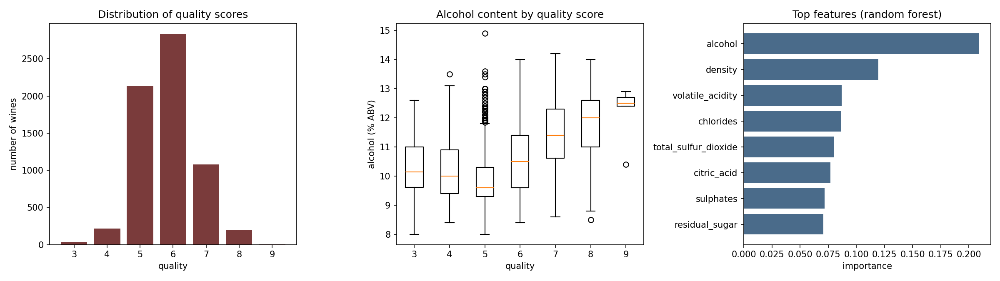

# Wine Quality — Data Analysis, Pandas vs Polars, and Rust Ownership

Week 1 of a three-week project. This repository contains a Pandas analysis of the
UCI wine-quality dataset, a Polars reimplementation with a performance
comparison, and a Jupyter notebook experimenting with Rust's ownership system.

## Dataset

[Red and White Wine Quality](https://www.kaggle.com/datasets/amirmohamadrezaie/red-and-white-wine-quality)
(Kaggle mirror of the UCI Wine Quality dataset).

This is the **merged** red + white version: 6,497 rows and 13 columns. Each row
is one physicochemical lab measurement of a Portuguese *vinho verde* sample,
plus a `quality` score from 0-10 assigned by the median of at least three blind
sensory assessments. Eleven numeric features (acidity, sugar, chlorides, sulfur
dioxide, density, pH, sulphates, alcohol), one integer target, and one
categorical `type` column marking the wine as red or white.

I picked this one because it has no missing values, is almost entirely numeric,
and supports both a regression and a classification framing -- which keeps week 2
(testing, CI, refactoring) about the engineering rather than about data cleaning.

**Scope note:** the model below uses only the eleven numeric features. The
`type` column is excluded, so the classifier is asked to judge red and white
wines by the same chemical yardstick. Encoding `type` as a feature is an obvious
extension and is listed under Next week.

## Setup

```bash
pip install -r requirements.txt
```

Download the CSV from the Kaggle link above and put it in `data/`. The scripts
locate it by globbing `data/*.csv` and sniff the delimiter automatically, so the
UCI semicolon-separated original and the comma-separated Kaggle mirror both work.

```bash
python analysis.py           # main analysis: EDA, filtering, grouping, ML, plot
python analysis_polars.py    # Polars reimplementation + benchmark
jupyter notebook rust_ownership.ipynb
```

## Repository layout

```
├── data/                     # dataset (not committed — see Setup)
├── figures/
│   └── wine_overview.png     # generated by analysis.py
├── data_utils.py             # shared loading helpers, used by both pipelines
├── analysis.py               # Pandas pipeline
├── analysis_polars.py        # Polars pipeline + benchmark
├── benchmark_results.csv     # generated by analysis_polars.py
├── rust_ownership.ipynb      # Rust ownership experiments
└── requirements.txt
```

## What the analysis does

**Import.** Delimiter is sniffed rather than hardcoded; column names are
normalised to `snake_case` so `Volatile Acidity` and `volatile acidity` both end
up as `volatile_acidity`.

**Inspect.** `.head()`, `.info()`, `.describe()`, a missing-value count, a
duplicate-row count, and the distribution of the target.

**Filter and group.** Subsets the wines above 11% ABV and compares their mean
quality to the overall mean. Groups by `quality` and computes mean alcohol,
volatile acidity, sulphates, and density per score.

**Machine learning.** Binary classification: `good = quality >= 7`. Compares
logistic regression (with standardisation) against a random forest, both with
balanced class weights, on an 80/20 stratified split. Reports accuracy, ROC-AUC,
per-class precision/recall, and random-forest feature importances.

**Visualisation.** A three-panel figure: quality distribution, alcohol by quality
score, and top features by importance.

## Findings

1. **No missing values, but 18% of the rows are duplicates.** 1,177 of 6,497
   rows (18.1%) are exact duplicates. They are kept for the EDA but dropped
   before the train/test split -- an identical row appearing in both sets would
   inflate test accuracy without the model having learned anything. This leaves
   5,320 rows for modelling.

2. **Quality is heavily imbalanced and concentrated in the middle.** Scores 5
   and 6 alone account for 76.6% of the dataset (2,138 and 2,836 wines). Only
   19.7% score 7 or above, and the extremes are barely populated: 30 wines score
   3 and just 5 score 9. Any group statistic for those two scores rests on too
   few samples to be trusted.

3. **Alcohol is the strongest signal, but the relationship is U-shaped, not
   linear.** Mean alcohol does not climb steadily with quality -- it *falls* to a
   minimum of 9.84% at quality 5, then rises to 11.39% at quality 7 and 12.18%
   at quality 9.

   | quality | 3 | 4 | 5 | 6 | 7 | 8 | 9 |
   |---|---|---|---|---|---|---|---|
   | n | 30 | 216 | 2138 | 2836 | 1079 | 193 | 5 |
   | mean alcohol (%) | 10.22 | 10.18 | 9.84 | 10.59 | 11.39 | 11.68 | 12.18 |

   The dip matters: the very worst wines are not the weakest ones. Quality 5 --
   the single largest group -- is where low-alcohol wine clusters, while wines
   scoring 3 and 4 sit slightly higher. A model assuming a monotonic
   alcohol-to-quality relationship would get this wrong. Alcohol is still the
   top feature by random-forest importance at 0.209, roughly twice the next
   feature.

4. **Density moves inversely, which is the same fact seen from another angle.**
   Mean density falls from 0.996 at the low scores to 0.991 at quality 9. Ethanol
   is less dense than water, so higher-alcohol wines are lighter -- density is
   the second most important feature (0.120) largely because it re-encodes
   alcohol. Two features carrying the same underlying signal is worth knowing
   before adding more model complexity.

5. **A filter confirms the direction.** Wines above 11% ABV (1,969 wines, 30.3%
   of the dataset) average 6.34 in quality against 5.82 overall -- half a point
   higher on a scale where almost everything sits between 5 and 6.

6. **Accuracy is the wrong headline metric here.** With 19% positives, always
   predicting "not good" already scores 0.810. The random forest reaches 0.847
   accuracy and 0.879 ROC-AUC, but only **0.32 recall** on the good class -- it
   buys its accuracy by rarely predicting "good" at all. Logistic regression with
   balanced class weights scores 0.735 accuracy, *below the baseline*, yet finds
   **0.78** of the good wines at 0.40 precision.

   | model | accuracy | ROC-AUC | precision (good) | recall (good) |
   |---|---|---|---|---|
   | baseline (always "not good") | 0.810 | -- | -- | 0.00 |
   | logistic regression | 0.735 | 0.816 | 0.40 | 0.78 |
   | random forest | 0.847 | 0.879 | 0.71 | 0.32 |

   Neither model is simply better. The forest ranks wines well (higher ROC-AUC)
   but its default 0.5 threshold is badly placed for this class balance. If the
   goal is to shortlist good wines for a human to taste, recall matters more than
   accuracy and logistic regression wins; if a false "good" is expensive, the
   forest's 0.71 precision wins. Tuning the forest's decision threshold rather
   than swapping models is the obvious next move.

7. **Some features have long right tails.** Residual sugar runs from a median of
   3.0 to a maximum of 65.8, and free sulfur dioxide from 29 to 289. These are
   plausible sweet wines and preservative-heavy samples rather than data errors,
   but they are worth remembering if a distance-based model is tried later.



## Pandas vs Polars

Both pipelines run the same three operations -- `read_csv`, a filter on
`alcohol > 11`, and a group-by with four aggregations. The script verifies that
the two group-by results are numerically identical before reporting any timings,
so the comparison is between two implementations of the same computation. Both
also agree on the filter: 1,969 of 6,497 rows, and 301,257 of 994,041 on the
scaled file.

Method: one untimed warm-up run per operation (to fill the OS page cache and
absorb first-call overhead), then 15 timed runs, reporting the **median** rather
than the mean so a single scheduling hiccup does not dominate.

The dataset is only 6,497 rows, so the benchmark is also run on a copy repeated
153 times to ~994,041 rows (60.5 MB) -- large enough for the scaling behaviour to
show.

### Original dataset (6,497 rows)

| Operation | Pandas (ms) | Polars (ms) | Speed-up |
|---|---|---|---|
| `read_csv` | 5.197 | 1.532 | 3.39x |
| `filter` | 0.214 | 0.885 | **0.24x** |
| `groupby + agg` | 3.129 | 0.763 | 4.10x |

### Scaled to ~994,041 rows

| Operation | Pandas (ms) | Polars (ms) | Speed-up |
|---|---|---|---|
| `read_csv` | 623.856 | 139.988 | 4.46x |
| `filter` | 16.072 | 5.620 | **2.86x** |
| `groupby + agg` | 46.562 | 5.510 | 8.45x |

### Interpretation

**The result is not "Polars is faster". It depends on the operation and on the
data size, and one cell above goes the other way.**

*Filtering is slower in Polars on the small dataset* -- 0.885 ms against 0.214 ms,
about four times worse. Filtering 6,497 rows is almost no work: Pandas builds a
boolean mask over a contiguous NumPy array in vectorised C and is done in a
fifth of a millisecond. Polars pays a fixed cost first -- constructing the
expression, handing it to its execution engine, coordinating worker threads --
and here that setup costs more than the filtering itself. The absolute gap is
0.67 ms, which no user would ever notice, but it is a clean illustration of
fixed overhead dominating when there is not enough work to amortise it.

*The same filter flips to 2.86x in Polars' favour at a million rows.* The setup
cost has not changed; the amount of real work has grown ~150x, so the overhead
stops mattering and the parallel columnar execution takes over. This single row
of the table, read across both scales, is the whole argument about when to reach
for Polars.

*Reading and grouping favour Polars even at 6,497 rows* (3.4x and 4.1x). Unlike
the filter, these do substantial per-column work regardless of row count -- CSV
parsing means tokenising and type-inferring every field, and a group-by means
hashing keys and maintaining accumulators. Polars is written in Rust, stores
data in Apache Arrow columnar format, and parallelises across cores by default,
so there is enough work here for that to pay off immediately. Pandas is largely
single-threaded.

*The group-by advantage widens with size*, from 4.1x to 8.45x, which is the
expected direction: more rows per group means more work to parallelise.

**A caveat on precision.** Running the benchmark twice on the same machine gave
3.22x and 8.45x for the scaled group-by. Timings on a laptop compete with
background processes, thermal throttling and cache state; the median over 15
runs suppresses outliers but does not make the number reproducible to two
decimal places. These results support "Polars is several times faster on this
workload at this scale", not any exact multiplier.

**Practical conclusion.** For a 6,497-row dataset the entire pipeline runs in
under 10 ms either way, so performance is not a reason to choose between them --
the deciding factors at this scale are API ergonomics and the expression system.
The scaling behaviour is what would justify Polars on a larger project.

### Lazy execution

`analysis_polars.py` also times `scan_csv(...).filter(...).group_by(...)
.collect()` on the scaled file: **75.4 ms**, against 139.988 ms for Polars just
to *read* the same file eagerly. The full pipeline finishing in roughly half the
time of one of its own steps is the point: in lazy mode Polars builds a query
plan before executing anything, sees that a filter follows the scan, and pushes
the predicate down into the CSV reader, so the ~693,000 rows that fail
`alcohol > 11` are never fully materialised. This is what a query planner does in
a database, and it is where the gap over eager Pandas is widest.

Note that the lazy pipeline's group-by output shows different counts and means
from the eager benchmark above -- that is expected, not a discrepancy: the lazy
pipeline applies the `alcohol > 11` filter before grouping, while the eager
group-by benchmark groups the unfiltered table.

## Rust ownership notebook

`rust_ownership.ipynb` runs on the [evcxr](https://github.com/evcxr/evcxr)
kernel:

```bash
cargo install evcxr_jupyter
evcxr_jupyter --install
```

The notebook walks through move semantics, `Copy` versus move, `clone`, ownership
transfer across function boundaries, the borrowing rules, non-lexical lifetimes,
`Drop`, and ownership inside a `Vec`. Cells marked **EXPECTED TO FAIL** are meant
to produce compiler errors — `evcxr` prints the error as cell output and
continues, so the notebook can be run top to bottom. Errors demonstrated:

| Code | Meaning |
|---|---|
| `E0382` | use of a moved value |
| `E0499` | two mutable borrows at once |
| `E0502` | a mutable borrow while an immutable one is live |

## Next week

Testing, continuous integration, and refactoring on this same codebase.
`data_utils.py` already isolates the loading logic and the analysis steps are
split into separate functions, which should make them straightforward to test
individually -- `detect_separator` and `normalise` in particular are pure
functions with obvious edge cases.

Analysis work still on the list:

- Encode `type` (red/white) and check how much of the signal it carries.
- Tune the random forest's decision threshold instead of using the 0.5 default,
  and report precision-recall curves rather than a single operating point.
- Check whether the U-shaped alcohol relationship survives once red and white
  are modelled separately, or whether it is an artefact of merging two
  populations with different alcohol distributions.
