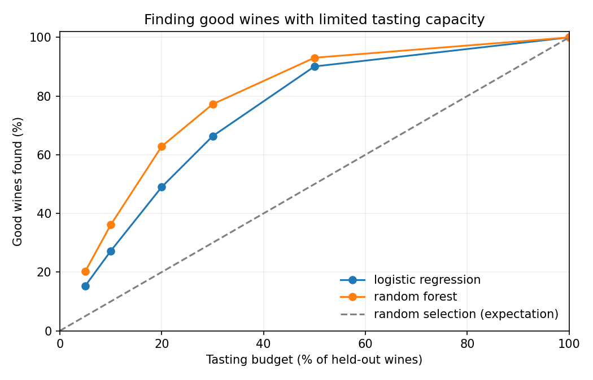
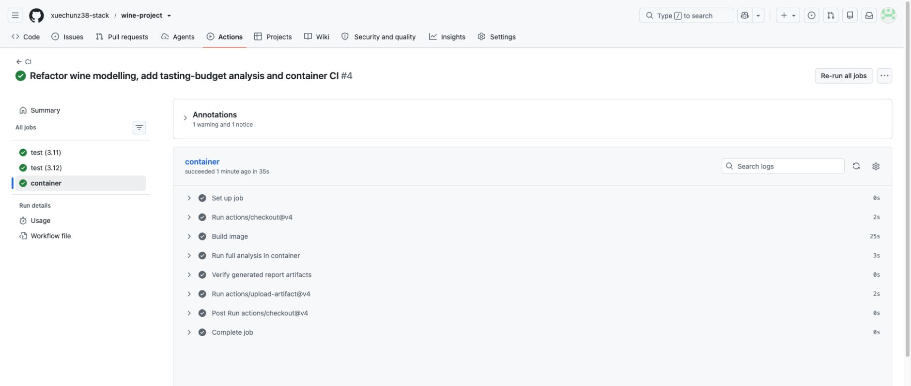

# Wine Quality: Finding Better Wines with Limited Tasting Time

[](https://github.com/xuechunz38-stack/wine-project/actions/workflows/ci.yml)

**IDS 706 · Week 4 · Repository A** — continuation of the earlier Pandas/Polars,
Rust, testing, and CI mini-assignments.

A tasting team cannot assess every wine. Can chemical measurements help it
shortlist wines scoring **7 or higher**, and how many good wines would it miss?
The new contribution compares models at the **same tasting budget**, rather
than treating default-threshold accuracy as the decision criterion.

## Run locally

Use Python **3.11 or 3.12**. The dataset is already committed; no download or API
key is required. From the repository root:

```bash
python -m venv .venv
source .venv/bin/activate              # Windows: .venv\Scripts\activate
python -m pip install -r requirements-dev.txt
make lint
make test
python analysis.py
```

`make` is optional: its checks are `python -m black --check .`,
`python -m ruff check .`, and `python -m pytest`.
The analysis writes two PNG plots and two CSV reports into `figures/`.
Set `WINE_OUTPUT_DIR` to choose another output directory.

## Data and method

The committed [merged red/white wine dataset](https://www.kaggle.com/datasets/amirmohamadrezaie/red-and-white-wine-quality)
is a mirror of [UCI Wine Quality](https://archive.ics.uci.edu/dataset/186/wine+quality):
**6,497 rows**, 11 chemical predictors, quality, and wine type.

- **Missing data:** the committed data has none. Modelling rejects missing or
  infinite numeric features and invalid quality labels with an explicit error;
  no full-dataset imputation can leak information into evaluation.
- **Duplicates:** EDA retains all observations; modelling removes **1,177 exact
  duplicate rows before splitting**, leaving 5,320 observations.
- **Outliers:** the report flags numeric predictors outside 1.5-IQR fences but
  retains them. A univariate flag alone does not prove measurement error, and
  automatic trimming could remove rare wine styles. See
  [outlier audit](figures/outlier_audit.csv).
- **Evaluation:** fixed, stratified 80/20 split (`random_state=42`); 1,064 test
  wines, including 202 good wines. Logistic regression uses training-only
  standardisation; both classifiers use balanced class weights.
- **Scope:** wine type is excluded to keep earlier results comparable. These
  observational results do not establish causation or generalise automatically
  to other regions, vintages, or tasting panels.

## Findings and the new tasting-budget analysis

| Model | Accuracy | ROC-AUC | Precision at default threshold | Recall at default threshold |
|---|---:|---:|---:|---:|
| Always predict not good | 0.810 | — | — | 0.000 |
| Logistic regression | 0.735 | 0.816 | 0.40 | 0.78 |
| Random forest | 0.847 | 0.879 | 0.71 | 0.32 |

Default thresholds allocate different amounts of tasting effort. At a fixed
**20% budget (213 of 1,064 test wines)**, ranking by predicted probability gives:

| Selection policy | Good wines found | Precision | Recall | Lift over random |
|---|---:|---:|---:|---:|
| Random selection, expectation | 40.4 | 19.0% | 20.0% | 1.00× |
| Logistic regression | 99 / 202 | 46.5% | 49.0% | 2.45× |
| Random forest | 127 / 202 | 59.6% | 62.9% | 3.14× |

The forest finds **28 more good wines at the same tasting workload**. This
supports using its ranking for a limited shortlist, while recognising that it
still misses 75 of the 202 good wines. Budgets were fixed before this report
(5%, 10%, 20%, 30%, 50%, 100%); no threshold was selected using test labels.
A later production choice would need validation data and a fresh final test.
Random figures are expectations, not a simulated random trial; rounding the
budget upward explains the slightly greater than 20% expected recall.



Alcohol has the largest forest impurity importance, which is predictive
association, not a causal effect. Quality scores 3 and 9 have only 30 and 5
observations; their group averages are especially uncertain.

[Full budget metrics](figures/tasting_budget.csv) ·
[EDA and model overview](figures/wine_overview.png)

## Docker

```bash
docker pull python:3.11-slim
docker build -t wine-project:week4 .
mkdir -p container-output
docker run --rm -v "$PWD/container-output:/app/figures" wine-project:week4
docker run --rm wine-project:week4 python -m pytest
docker ps -a
docker images wine-project
```

The Dockerfile uses an official Python image pinned by digest, installs the
versioned dependencies, and runs as an unprivileged user. The batch container
exits successfully after producing the report; it is not a long-running server.
A bind mount preserves results after `--rm` removes the container. On Linux,
if the output directory is not writable by UID 10001, run with
`--user "$(id -u):$(id -g)"`; the image keeps Matplotlib's cache in `/tmp`.
No ports or Compose services are needed.

Local image build succeeded; complete container execution is verified in
GitHub Actions. The local Docker runtime check is still pending; see the dated
[verification record](docs/verification.md) for the current limitation.



## Refactoring, tests, and CI

The earlier `explore_model` mixed data preparation, model construction,
fitting, scoring, and printing. It now delegates computation to
[`wine_models.py`](wine_models.py); [`wine_decisions.py`](wine_decisions.py)
contains the separately testable tasting-budget calculation and outlier audit.
`analysis.py` orchestrates reporting, preserving existing helper imports and
model settings so earlier tests remain useful.

**70 tests** cover normal behaviour, boundary labels, empty/invalid inputs,
missing values, one-class data, tied rankings, zero-positive recall, duplicate
handling, Pandas/Polars agreement, and complete report generation. Hand-counted
shortlist examples provide an independent oracle; real-data regression tests
check the earlier model results. Black formats Python code and Ruff checks it.

CI runs formatting, linting, and tests on Python 3.11 and 3.12 for pushes and
pull requests. A Monday schedule checks the project again, and a separate job
builds/runs Docker and saves report artifacts. The badge links to actual runs.
See [refactoring evidence](docs/refactoring.md).

## Earlier work and limitations

`python analysis_polars.py` checks Pandas/Polars results and benchmarks loading,
filtering, and grouping on the original and repeated data; timings depend on
the machine. The [Rust notebook](rust_vs_python_intro.ipynb) and
[earlier analysis notes](docs/previous-analysis.md) are retained from previous
mini-assignments. The notebook needs a separate Rust/evcxr Jupyter environment;
it is not part of the Python container or CI.

This is a single held-out split, with no uncertainty intervals or external
validation. Feature importance can be distorted by correlated predictors.
Future work should compare wine types separately and validate the ranking on
new samples. AI assistance was used for the Week 4 refactoring, tests, and
writing; the linked code, commits, and execution evidence make those changes
inspectable.
