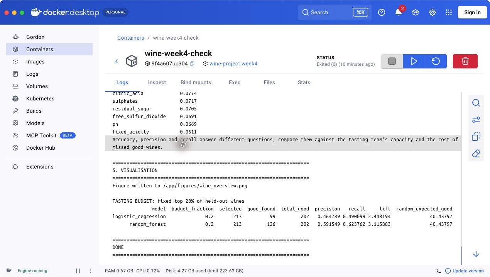

# Wine Quality: Finding Better Wines with Limited Tasting Time

[](https://github.com/xuechunz38-stack/wine-project/actions/workflows/ci.yml)

**IDS 706 · Week 4 · Repository A** — continuation of the earlier mini-assignments.

A tasting team cannot assess every wine. Can chemical measurements help it
shortlist wines scoring **7 or higher**, and how many good wines would it miss?
The new contribution compares models at the **same tasting budget**, connecting
model predictions to a concrete decision instead of relying on accuracy alone.

## Run locally

Use Python **3.11 or 3.12**. Data is committed; no API key or download is needed.

```bash
python -m venv .venv
source .venv/bin/activate
python -m pip install -r requirements-dev.txt
make lint
make test
python analysis.py
```

On Windows, activate `.venv\Scripts\activate`. Without `make`, use
`python -m black --check .`, `python -m ruff check .`, and `python -m pytest`.
The analysis writes two PNGs and two CSVs to `figures/`; set `WINE_OUTPUT_DIR`
to choose another output directory.

## Data and method

The [committed data source](https://www.kaggle.com/datasets/amirmohamadrezaie/red-and-white-wine-quality)
mirrors [UCI Wine Quality](https://archive.ics.uci.edu/dataset/186/wine+quality):
**6,497 rows**, 11 chemical predictors, quality, and wine type.

- **Cleaning:** no missing values occur in the data. Modelling rejects missing,
  infinite, or invalid values and removes **1,177 exact duplicates before
  splitting**, leaving 5,320 observations. EDA retains the original rows.
- **Outliers:** a [1.5-IQR audit](figures/outlier_audit.csv) flags unusual values
  without deleting them; an extreme value alone does not establish an error.
- **Evaluation:** fixed stratified 80/20 split (`random_state=42`), with 1,064
  test wines and 202 good wines. Logistic regression uses training-only scaling;
  both models use balanced class weights. Wine type is excluded for continuity.

[Method details and limitations](docs/methods-and-limits.md).

## Findings

| Model | Accuracy | ROC-AUC | Default precision | Default recall |
|---|---:|---:|---:|---:|
| Always predict not good | 0.810 | — | — | 0.000 |
| Logistic regression | 0.735 | 0.816 | 0.40 | 0.78 |
| Random forest | 0.847 | 0.879 | 0.71 | 0.33 |

Default thresholds imply different tasting workloads. At a **20% budget
(213 test wines)**, ranking by predicted probability gives:

| Selection policy | Good wines found | Precision | Recall | Lift over random |
|---|---:|---:|---:|---:|
| Random selection, expectation | 40.4 | 19.0% | 20.0% | 1.00× |
| Logistic regression | 99 / 202 | 46.5% | 49.0% | 2.45× |
| Random forest | 126 / 202 | 59.2% | 62.4% | 3.12× |

The forest finds **27 more good wines at the same workload**, supporting its use
for a limited shortlist. It still misses **76 of 202** good wines. The fixed
budget grid is 5%, 10%, 20%, 30%, 50%, and 100%; no threshold was tuned on test
labels. Random-selection figures are expectations; rounding the budget upward
makes expected recall slightly greater than 20%.


[Full budget metrics](figures/tasting_budget.csv) ·
[EDA and model overview](figures/wine_overview.png)

Tables and figures use the verified Linux arm64/Python 3.11 container run.
A macOS/Python 3.12 run found 127 rather than 126 good wines at the 20% budget;
the comparison is unchanged, but exact rankings are not portable across the
tested environments. [Both results and caveats](docs/verification.md) are saved.
This single observational split establishes neither causation nor performance
on future wines; external validation remains necessary.

## Docker

```bash
docker pull python:3.11-slim
docker build -t wine-project:week4 .
mkdir -p container-output
docker run --rm -v "$PWD/container-output:/app/figures" wine-project:week4
docker run --rm wine-project:week4 python -m pytest
docker ps -a
docker images wine-project
```

The image pins an official Python base by digest, installs versioned dependencies,
and runs as non-root. It exits after producing reports; the bind mount preserves
them after container removal. On Linux, if UID 10001 cannot write the mounted
directory, add `--user "$(id -u):$(id -g)"`. No ports or Compose are needed.

Local build, full analysis, mounted output, and **70 container tests** passed.
[Verification logs and CI evidence](docs/verification.md) include the actual
September 30 executions.



## Refactoring, tests, and CI

The long `explore_model` function now delegates validation, training, and scoring
to [`wine_models.py`](wine_models.py). Separately testable budget calculations
and the outlier audit live in [`wine_decisions.py`](wine_decisions.py).
`analysis.py` presents results while preserving earlier helper imports and model
settings. [Before/after commit and screenshot](docs/refactoring.md).

**70 tests** cover normal and invalid inputs, missing values, boundary labels,
one-class data, tied rankings, zero-positive recall, duplicate handling,
Pandas/Polars agreement, and report generation. Hand-counted shortlist cases
and real-data regression tests check the results. Black and Ruff pass.

CI checks formatting, lint, and tests on **Python 3.11 and 3.12**, on pushes,
pull requests, and a **Monday schedule**. A separate job builds/runs Docker and
saves reports. The badge links to actual workflow runs.

Earlier Pandas/Polars benchmarks, the Rust notebook, and their environment limits
remain documented in [earlier work](docs/methods-and-limits.md#earlier-work-and-limitations).
AI assistance was used for Week 4 code and writing; commits and execution evidence
make the changes inspectable.
