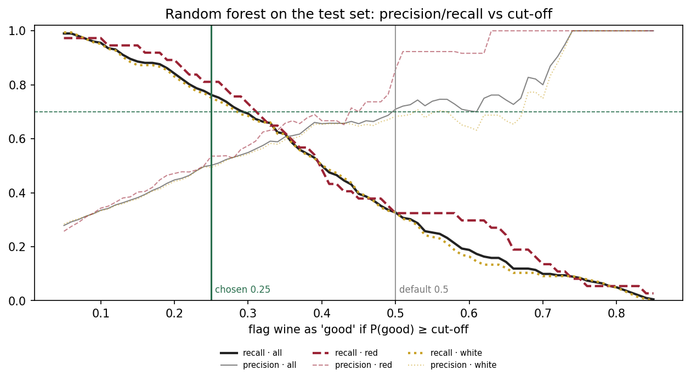
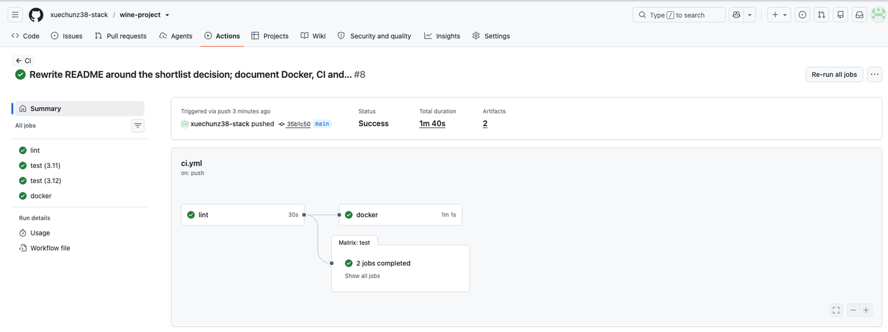
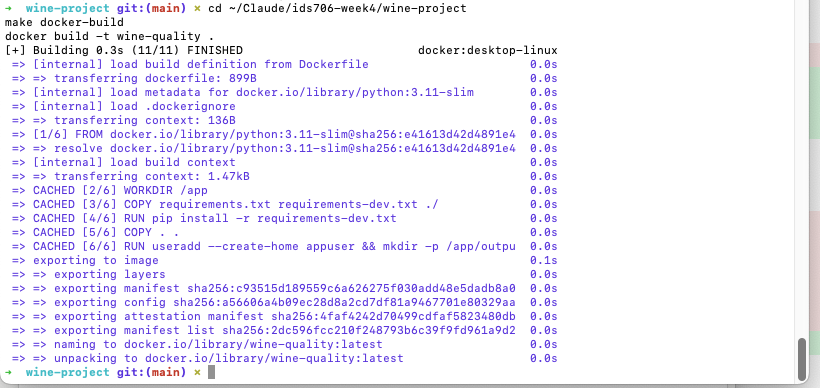
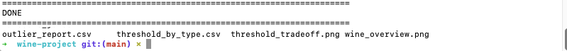
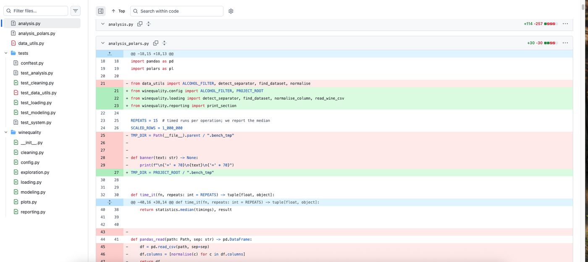

# Wine Quality: Shortlisting Good Wines from Lab Chemistry

[](https://github.com/xuechunz38-stack/wine-project/actions/workflows/ci.yml)

IDS 706 · Week 4 · **Repository A** — the improved version of my three-week data analysis project.

## Problem

A tasting panel cannot taste every wine a producer submits. Lab chemistry
(alcohol, acidity, sulphates, …) is cheap and available for every sample.
**Can a model use it to build a tasting shortlist that catches most of the
wines scoring 7+, without asking the panel to taste far more wines than
necessary — and does it work equally well for red and white wines?**

Weeks 2–3 answered “which model is more accurate?”. Week 4 turns that into a
decision: pick a cut-off that delivers the recall the panel needs, choose it
without peeking at the test set, and check it separately for red and white.

## Quick start

Python 3.11 or 3.12. The dataset is committed, so nothing needs downloading.

```bash
python -m venv .venv && source .venv/bin/activate   # Windows: .venv\Scripts\activate
make install        # pip install -r requirements-dev.txt
make lint           # black --check + flake8
make test           # pytest: 66 unit/system tests (+4 Pandas/Polars parity tests)
make run            # python analysis.py  -> figures/
```

`analysis.py` writes `wine_overview.png`, `threshold_tradeoff.png`,
`outlier_report.csv` and `threshold_by_type.csv` to `figures/` (override with
`WINE_OUTPUT_DIR`). `make benchmark` reruns the Pandas vs Polars comparison
([write-up](docs/pandas-vs-polars.md)).

```
├── analysis.py            # orchestrates steps 1–7, prints the report
├── analysis_polars.py     # Pandas vs Polars benchmark (reuses the shared loader)
├── winequality/           # importable, tested building blocks
│   ├── config.py          #   paths, constants, WINE_OUTPUT_DIR
│   ├── loading.py         #   find / sniff / read the CSV, normalise headers
│   ├── cleaning.py        #   validation, target, duplicates, IQR outlier audit
│   ├── exploration.py     #   inspection, filtering, grouping
│   ├── modeling.py        #   models, evaluation, threshold selection, per-group metrics
│   ├── plots.py           #   figures
│   └── reporting.py       #   console section headers
├── tests/                 # one test file per module + end-to-end system tests
├── Dockerfile · Makefile · .github/workflows/ci.yml
└── data/wine_quality_merged.csv
```

## Data and cleaning

[UCI Wine Quality](https://archive.ics.uci.edu/dataset/186/wine+quality) via a
[Kaggle mirror](https://www.kaggle.com/datasets/amirmohamadrezaie/red-and-white-wine-quality):
6,497 Portuguese *vinho verde* samples (1,599 red, 4,898 white), 11 chemical
measurements, a 0–10 sensory `quality` score and a `type` column.
“Good” means quality ≥ 7 (19.0% of the de-duplicated wines).

- **Validation.** Before modelling, `validate_wine_frame` stops with a named
  error if the table is empty, a required column is missing, or a model input
  holds missing, text or infinite values. The real data passes: **no missing values**.
- **Duplicates.** 1,177 rows (18.1%) are exact duplicates. They stay in the EDA
  but are removed **before** the train/test split, otherwise identical wines
  would sit in both sets and inflate scores. 5,320 wines remain for modelling.
- **Outliers are flagged, not deleted.** The [1.5×IQR audit](figures/outlier_report.csv)
  flags e.g. 509 citric-acid and 377 volatile-acidity values. My domain check:
  **341 of the 377 volatile-acidity “outliers” are red wines**, and all 115
  residual-sugar ones are white. Red wines are naturally higher in volatile
  acidity and whites can be sweet, so most flags reflect *wine type*, not
  measurement errors. Deleting them would quietly remove much of the red
  sample, so they are kept; tree models are insensitive to them and logistic
  regression uses standardised inputs.

## Findings

**1. Alcohol carries most of the signal, with a U-shape.** Mean alcohol falls
to 9.84% at quality 5, then rises to 11.39% at 7 and 12.18% at 9. Alcohol is the
forest’s top feature (importance 0.21), density second — largely because
ethanol is lighter than water, so density re-encodes alcohol.

**2. At the default 0.5 cut-off neither model is usable for a shortlist.**
Always predicting “not good” already scores 0.810 accuracy.

| Model (test set, 1,064 wines, 202 good) | Accuracy | ROC-AUC | Precision | Recall |
|---|---:|---:|---:|---:|
| Always “not good” | 0.810 | — | — | 0.00 |
| Logistic regression | 0.735 | 0.816 | 0.40 | 0.78 |
| Random forest @ 0.5 | 0.847 | 0.879 | 0.71 | 0.33 |

The forest ranks wines better (higher ROC-AUC) but at 0.5 misses two-thirds of
the good wines.

**3. New this week — choose the cut-off for the panel’s goal, on training data
only.** I assume the panel wants to catch **≥ 70% of good wines**. Using 5-fold
out-of-fold probabilities on the *training* set, the highest cut-off meeting
that target is **0.25** (training CV recall 0.71). Applied once to the untouched
test set:

| Shortlist rule | Wines to taste | Good wines found | Precision | Recall |
|---|---:|---:|---:|---:|
| Random forest @ 0.50 | 93 | 66 / 202 | 0.71 | 0.33 |
| Logistic regression @ 0.50 | 396 | 158 / 202 | 0.40 | 0.78 |
| **Random forest @ 0.25 (chosen on training folds)** | **307** | **154 / 202** | **0.50** | **0.76** |

The tuned forest finds almost as many good wines as logistic regression while
the panel tastes **89 fewer wines** (−22%). Week 3 concluded “neither model is
simply better”; the real issue was the cut-off, not the model.



**4. New this week — the same rule for red and white.**

| Type (test) | Good wines | Flagged | Found | Precision | Recall | ROC-AUC |
|---|---:|---:|---:|---:|---:|---:|
| Red | 37 | 56 | 30 | 0.54 | 0.81 | 0.93 |
| White | 165 | 251 | 124 | 0.49 | 0.75 | 0.86 |

One pooled model and one cut-off meet the 70% target for both types; it ranks
reds better than whites. I also tried adding `type` as a feature and training
separate red/white forests (exploratory, not in the pipeline): ROC-AUC barely
moved (0.876 vs 0.879 pooled), so the simpler pooled model is kept. With only
37 good reds in the test set, the red recall of 0.81 is uncertain by several
points either way.

**Takeaways.** (1) Report the decision metric (wines tasted, good wines
missed), not accuracy. (2) Tune cut-offs on training folds, never the test set.
(3) Check subgroups; pooled outlier rules and pooled metrics can hide type
differences. **Limits:** one observational split from one region; scores are
human panel medians; numbers say nothing about causation or future vintages.
Results were regenerated in this repo; small numeric differences across
library versions are covered by tolerances in `tests/test_system.py`.

## Testing and CI

`tests/` has one file per module plus end-to-end tests (66 tests, plus 4 Polars
parity tests that run when Polars is installed). Besides typical cases they
cover edge cases such as: an empty table, a missing column, `NaN`/`inf`/text in
a model input, semicolon vs comma files and a UTF-8 BOM, the quality-7 boundary,
a class with fewer than two examples (split refuses), a constant column in the
outlier audit, an invalid recall target, a group with only one class (AUC is
NaN, no crash), and a spy test proving the cut-off is chosen without test labels.
`test_system.py` reruns the real data and fails if the README numbers drift.

[`ci.yml`](.github/workflows/ci.yml) runs on every push/PR, weekly on a
schedule, and on demand: **lint** (black + flake8) → **test** on a Python
3.11/3.12 matrix (pytest + full analysis, outputs uploaded as artifacts) and
**docker** (build the image, run the tests and the analysis inside it).



## Docker

```bash
make docker-build     # docker build -t wine-quality .
make docker-run       # writes outputs to ./output via a mounted volume
make docker-test      # pytest inside the container
```

The image uses `python:3.11-slim`, installs pinned requirements in a separate
layer (so code changes rebuild in seconds), runs as a non-root user, and writes
to `/app/output` so results land on the host through `-v`. Practised along the
way: `docker pull python:3.11-slim`, `docker images`, `docker ps`.
**What I learned:** without the volume mount the figures are created and then
lost with the container, and the non-root user needs ownership of the output
folder. Because `make docker-run` uses `--rm`, the finished container is
removed automatically, so it does not appear in `docker ps -a` afterwards.




## Refactoring

| What changed | Why | 
|---|---|
| Split `analysis.py` (≈300 lines) and `data_utils.py` into the `winequality/` package (`loading`, `cleaning`, `modeling`, `plots`, …) | Each piece can be imported and unit-tested; `analysis.py` is now only the narrative |
| `analysis_polars.py` reuses `read_wine_csv` and `print_section` instead of its own copies; `banner()` → `print_section()`, `normalise()` → `normalise_column()` | Removes duplicated code and clarifies names; the benchmark now times the same loader the analysis uses |
| The ~75-line `explore_model()` became `compare_models()` + `tune_threshold()`; model constructors are `make_logistic_regression()` / `make_random_forest()` | Smaller functions with one job; the cut-off logic is testable in isolation |
| Paths and constants moved to `config.py`; output folder via `WINE_OUTPUT_DIR` | Needed for Docker volumes and lets tests write to a temp folder instead of monkey-patching globals |
| black (line length 100) + flake8 in `Makefile` and CI | Consistent style enforced automatically |

**Verification:** the Week 3 tests were moved alongside their functions and
kept passing after each step; the real-data system test confirms the
Week 3 headline numbers (0.810 baseline, 0.879 forest ROC-AUC, 1,177
duplicates) are unchanged; `black --check` and `flake8` are clean.



## Earlier weeks

- [Pandas vs Polars benchmark](docs/pandas-vs-polars.md) — `analysis_polars.py`
- `rust_vs_python_intro.ipynb` — Rust ownership notebook (evcxr kernel:
  `cargo install evcxr_jupyter && evcxr_jupyter --install`)
