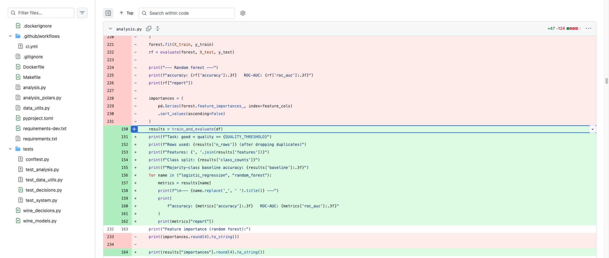

# Refactoring evidence

## Before and after

Previously, `analysis.explore_model` prepared features, split data, constructed
and fitted two models, calculated metrics, and printed the report in one long
function. The implementation now separates computation from presentation:

- `wine_models.fit_models` owns the two model definitions and training.
- `wine_models.train_and_evaluate` owns validation, the fixed split, and results.
- `analysis.explore_model` presents those results without reimplementing fitting.
- `wine_decisions.shortlist_metrics` computes an explicitly sized shortlist;
  `write_decision_report` handles CSV/plot outputs separately.

This keeps the fixed seed, 300-tree forest, class weighting, and original test
split. Existing helper names remain available from `analysis` for backwards
compatibility. Missing quality no longer silently becomes a negative label;
invalid features, empty labels, and insufficient classes fail clearly.

Black also normalised formatting in existing Python files. Ruff is checked in
CI. The original tests are retained, and new hand-calculated/edge-case tests
check the new behaviour. The README explains the decision implications rather
than repeating the earlier claim that every useful model must beat baseline
accuracy.

[Commit 1cdec4e: complete before/after diff](https://github.com/xuechunz38-stack/wine-project/commit/1cdec4ee9fbc1081712a6ef25974d1ddd6f84554)

The screenshot shows model fitting/scoring removed from the reporting function
(red) and replaced with the reusable computation plus a shared reporting loop
(green).

