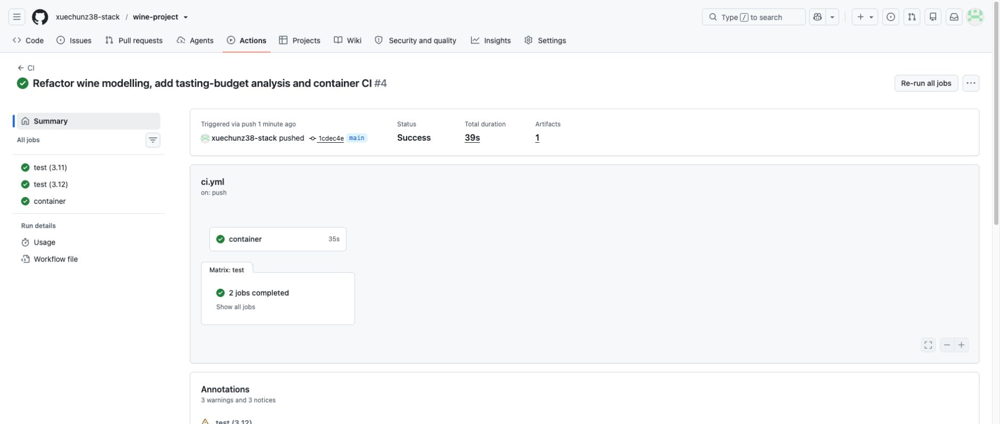

# Verification record — September 30, 2026

## Local Python and container checks

- **Native Python:** macOS arm64, Python 3.12.14; versioned dependencies from
  `requirements-dev.txt`. Black and Ruff passed. **70 tests passed in 28.75s**.
  [Saved pytest output](evidence/pytest-local.txt).
- **Local Docker build:** Docker Desktop 4.88.1 / Engine 29.7.2, Linux arm64
  engine. Official Python 3.11 slim base pinned by manifest digest. BuildKit
  successfully exported `wine-project:week4`.
  [Successful build log](evidence/docker-build.txt).
- **Local full analysis:** both `wine-week4-check` (bind mount) and
  `wine-week4-internal` (image filesystem) completed with **exit code 0**.
  The bind mount preserved both PNGs and CSV reports in `container-output/`.
  Copying the internal container's files with `docker cp` also succeeded.
  [Analysis log](evidence/docker-run.txt) ·
  [Internal-filesystem run](evidence/docker-run-internal.txt) ·
  [Docker status and image listing](evidence/docker-status.txt).
- **Container tests:** `docker run --rm wine-project:week4 python -m pytest`
  completed with **70 passed in 44.85s**.
  [Complete test output](evidence/pytest-docker.txt).

The earlier local startup delay is resolved. These are actual agent-run checks;
no student-performed manual test is claimed for this repository.

## Environment sensitivity

The README tables and committed figures now use the verified local **Linux
arm64 / Python 3.11 container** results. At the 20% budget, logistic regression
found 99/202 good wines in both observed environments. The forest found **126**
in the container and **127** in native macOS/Python 3.12. Some other budget
rankings differ too; the raw reports are retained:

- [Reference container budget metrics](../figures/tasting_budget.csv)
- [Native macOS budget metrics](evidence/macos-tasting_budget.csv)

The default-threshold accuracy and ROC-AUC round to the same headline values,
and both environments pass the existing metric tolerance checks. The outlier
CSV matches byte-for-byte. The forest probability rankings are not bit-for-bit
portable across these environments; the exact low-level cause was not isolated.
The results support a limited-budget ranking advantage, not an exact universal
count. A fixed seed controls randomisation but does not prove numerical identity
across platforms and builds.

The base image digest and direct dependency versions are fixed. All transitive
wheels are not hash-locked, so exact image bytes are not guaranteed across
rebuilds. Plot rendering and benchmark timings can also differ by machine.

## GitHub Actions

[Run 36646890746](https://github.com/xuechunz38-stack/wine-project/actions/runs/36646890746)
for code commit `1cdec4ee9fbc1081712a6ef25974d1ddd6f84554` succeeded. Python
3.11/3.12 jobs passed formatting, lint, and tests. The separate Docker job built
the image, ran the full analysis, checked output files, and uploaded the
`wine-analysis` artifact. Later documentation commits use the same code.

Upstream Node-action deprecation notices did not fail any job. Current status is
available through the README badge; historical screenshots show the linked run.
